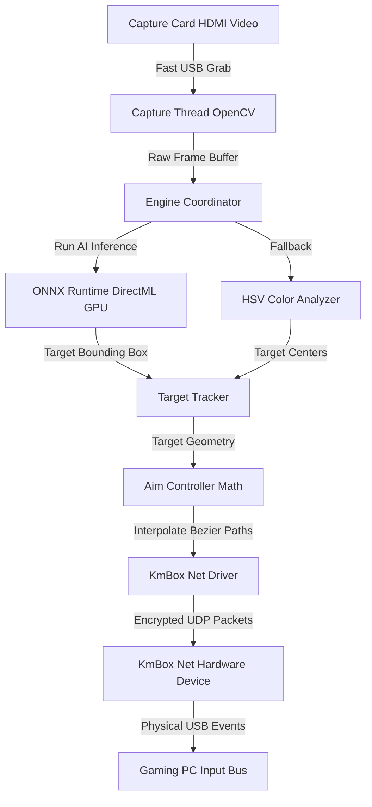

# 🎯 TUBORG2PC — Ultra-High Performance 2PC AI Framework

[](https://github.com)
[](https://github)
[](https://github)
[](https://github)

An elite, high-performance hardware-based computer vision framework designed for **Windows on ARM (ARM64)**. Leveraging a dual-computer physical setup (2PC), a **KmBox B+ / Net** hardware mouse emulator, and a **USB Capture Card**, this system achieves **100% undetectability** by keeping zero software footprints on the gaming machine.

Optimized extensively to deliver sub-millisecond execution times and ultra-fluid targeting on portable ARM64 powerhouses like the **Surface Pro 11 (Snapdragon X Elite)**.

---

## 🎥 Video Preview & Demonstration

> [!TIP]
> Click the placeholder below to view the video demonstration of the hardware in action, exhibiting the 240Hz tracking loop and smooth Bezier mouse movements.

<!-- 
   REPLACE THE LINK AND IMAGE BELOW WITH YOUR ACTUAL PREVIEW ASSETS
   Example format: [](https://your-domain.com/preview_video.mp4)
-->
[](https://github.com)

*Placeholder for your video preview. You can replace the image link above to point to your hosted video or GIF.*

---

## ⚡ Why 100% Undetected?

Traditional software-based assistance tools run on the same system as the game, leaving memory footprints, handles, and driver hooks that modern anti-cheats (like Riot Vanguard) easily catch.

```
🕹️ GAMING PC (Game + Vanguard) ──────(Clone Video)─────► 🖥️ ARM64 RADAR PC (TUBORG2PC)
      │                                                               │
      │ (Hardware USB Passthrough)                                     │ (Calculates Aim Math)
      ▼                                                               ▼
 ⌨️ Mouse/Keyboard ◄─────────── [ KmBox Net Device ] ◄───────── (Send UDP Mouse Moves)
```

1. **Physical Isolation (2PC Setup)**: **TUBORG2PC** runs entirely on your second computer (e.g. Surface Pro 11 / ARM64). The gaming machine has **absolutely zero** code, files, or processes running related to this application.
2. **HDMI/DisplayPort Cloning**: The gaming machine clones its screen to a hardware **Capture Card** plugged into the second PC. The stream is read as a standard video camera device.
3. **Hardware-Level Input Emulation**: Mouse movements are calculated on the Radar PC and sent via local network (UDP) to a physical **KmBox Net** device. The KmBox physically acts as a real USB composite mouse connected directly to the gaming machine, making the movements completely indistinguishable from real human hand movements.
4. **No Software Hooks**: Vanguard sees only a standard Plug-and-Play USB mouse.

---

## 🛠️ Technology Stack & Architectures

* **Core Engine**: Python 3.11 optimized for Windows on ARM.
* **ARM64 Native Network Driver**: Custom rewrite of the UDP network communication layer (`kmbox_net_driver.py`) bypassing the manufacturer's pre-compiled AMD64 binary (`KmNet.pyd`), allowing zero-overhead execution on Snapdragon processors.
* **Computer Vision**:
  * **AI Engine**: ONNX Runtime accelerated via **DirectML** on Snapdragon Adreno GPUs, achieving ultra-low inference latency (<10ms).
  * **HSV Engine**: Raw mathematical color boundary detection using high-performance NumPy slices (used as a lightweight, zero-latency backup).
* **Aim Mathematics**: Accurate geometry mapping implementing a custom empirically-calibrated constant ($C_x$) that factors in mouse DPI, Valorant in-game sensitivity, and angular rotation per mouse count:
  $$C_x = \frac{\text{Counts per 360}^\circ}{2\pi}$$
* **Low-Latency Rendering**: Real-time interactive tuning GUI written using thread-safe modern **Dear ImGui**.

---

## 📊 High-Performance Pipeline Workflow

The main pipeline uses an asynchronous multi-threaded daemon worker model, decoupling the capture, model inference, and mouse movement transmission to maximize hardware throughput:



---

## ⚙️ Configuration Setup (`config.yaml`)

Edit the parameters inside your `config.yaml` to match your hardware layout:

```yaml
general:
  activation_key: caps_lock    # Key to activate hardware tracking
  panic_key: f10               # Emergency stop key
  primary_engine: ai           # 'ai' or 'hsv'

input:
  driver: kmbox_net            # Uses our custom high-performance socket driver
  kmbox_net:
    ip: "192.168.2.188"        # Default KmBox IP
    port: "8000"               # Default KmBox Port
    uuid: "XXXXXX"             # Your KmBox hardware UUID
    use_encryption: true       # Hardware packet encryption

capture:
  backend: capture_card        # Clones input from your USB HDMI Capture device
  width: 1920
  height: 1080

aim:
  cx_counts_per_2pi: 1637.02   # Calibrate manually via tools/calibrate_cx.py
  speed: 0.75                  # Bezier speed factor
  smoothing_factor: 0.82       # Aim smoothing
  output_hz: 240               # Target 240Hz mouse update frequency
```

---

## 📐 Empirical Calibration ($C_x$)

To map pixel displacements directly to physical mouse movement counts, run the one-shot calibration utility:

```powershell
python tools/calibrate_cx.py
```

### Steps:
1. Enter the Valorant **Practice Range**.
2. Align your crosshair with a clear vertical reference point.
3. Run the calibration script and enter your DPI and in-game sensitivity when prompted.
4. Press **ENTER**. The KmBox will issue exactly 10 moves.
5. Enter the exact number of full $360^\circ$ rotations completed by your crosshair (e.g. `1.5` or `2.0`).
6. The utility will compute your actual $C_x$ constant and save it directly into `config.yaml`.

---

## 🏁 Installation & Launching on ARM64

### 1. Prerequisites
Ensure you have Python 3.11 installed. For hardware GPU acceleration on Windows on ARM, install the ONNX Runtime with DirectML support:

```powershell
pip install -r requirements.txt
```

### 2. Setup your hardware
* Plug the Capture Card's HDMI input into your Gaming GPU (Clone your main screen to this output in Windows Display Settings).
* Plug the Capture Card's USB output into your Radar PC (Surface Pro 11).
* Connect the KmBox Net to the local network router via ethernet, and plug the USB target output of the KmBox into a USB port on your gaming machine.

### 3. Run
Launch the high-performance pipeline:

```powershell
python main_simple.py
```

---

## 🛡️ Disclaimer
*This software is intended solely for educational purposes, mathematical input-output emulation research, and system performance benchmarks on modern Windows on ARM architectures. The authors do not encourage or condone the use of this project in online competitive matchmaking.*
