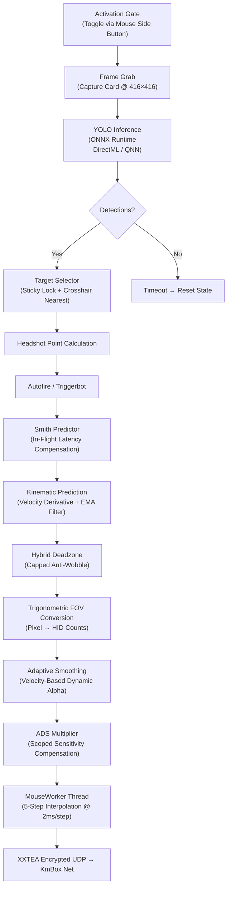

# 🎯 TUBORG2PC — Ultra-High Performance 2PC AI Aimbot

[](https://github.com)
[](https://github)
[](https://github)
[](https://github)

An elite, high-performance hardware-based computer vision aimbot designed for **Windows on ARM (ARM64)**. Leveraging a dual-computer physical setup (2PC), a **KmBox B+ / Net** hardware mouse emulator, and a **USB Capture Card**, this system achieves **100% undetectability** by keeping zero software footprints on the gaming machine.

Optimized extensively to deliver sub-millisecond execution times and ultra-fluid targeting on portable ARM64 powerhouses like the **Surface Pro 11 (Snapdragon X Elite)**.

---

## ⚡ Why 100% Undetected?

Traditional software-based assistance tools run on the same system as the game, leaving memory footprints, handles, and driver hooks that modern anti-cheats (like Riot Vanguard) easily catch.

```
🕹️ GAMING PC (Game + Vanguard) ──────(Clone Video)─────► 🖥️ ARM64 RADAR PC (TUBORG2PC)
      │                                                               │
      │ (Hardware USB Passthrough)                                     │ (AI Inference + Aim Math)
      ▼                                                               ▼
 ⌨️ Mouse/Keyboard ◄─────────── [ KmBox Net Device ] ◄───────── (Encrypted UDP Mouse Moves)
```

1. **Physical Isolation (2PC Setup)**: **TUBORG2PC** runs entirely on your second computer (e.g. Surface Pro 11 / ARM64). The gaming machine has **absolutely zero** code, files, or processes running related to this application.
2. **HDMI/DisplayPort Cloning**: The gaming machine clones its screen to a hardware **Capture Card** plugged into the second PC. The stream is read as a standard video camera device.
3. **Hardware-Level Input Emulation**: Mouse movements are calculated on the Radar PC and sent via local network (UDP) to a physical **KmBox Net** device. The KmBox physically acts as a real USB composite mouse connected directly to the gaming machine, making the movements completely indistinguishable from real human hand movements.
4. **No Software Hooks**: Vanguard sees only a standard Plug-and-Play USB mouse.

---

## 🛠️ Technology Stack

* **Core Engine**: Python 3.11 optimized for Windows on ARM.
* **ARM64 Native Network Driver**: Custom pure-Python rewrite of the UDP communication layer (`kmbox_net_driver.py`) bypassing the manufacturer's pre-compiled AMD64 binary (`KmNet.pyd`), allowing zero-overhead execution on Snapdragon processors. Includes XXTEA packet encryption with a native C accelerator DLL.
* **Computer Vision**: **YOLOv8** object detection via ONNX Runtime, accelerated through **DirectML** on Snapdragon Adreno GPUs or **Qualcomm QNN** NPU, achieving ultra-low inference latency (<10ms).
* **Trigonometric FOV Conversion**: Accurate pixel-to-mouse-count mapping using a calibrated $C_x$ constant that accounts for mouse DPI, in-game sensitivity, and angular rotation geometry:
  $$C_x = \frac{\text{Counts per 360}^\circ}{2\pi}$$
* **Non-Blocking Mouse Worker**: Dedicated daemon thread with 5-step software interpolation (2ms micro-steps) for smooth, human-like mouse movement delivery.

---

## 📊 Pipeline Architecture

Single-threaded detection loop with asynchronous mouse dispatch. The entire pipeline runs in one hot-path, maximizing frame throughput:



---

## 🧠 Key Features

### Sticky Target Lock
Two-phase target selector that maintains lock on the same enemy across frames. Once acquired, the target is tracked within a configurable `lock_radius_px` relative to its last known head position — preventing accidental target switching in multi-enemy situations. Falls back to crosshair-nearest acquisition when the lock breaks.

### Adaptive Smoothing (Anti-Jiggle Peak)
Dynamic EMA alpha that adjusts in real-time based on target velocity. When the target is stationary, heavy smoothing prevents robotic micro-corrections. When the target strafes fast (jiggle peaks), the damping automatically loosens for reactive flick tracking.

### Smith Predictor (In-Flight Compensation)
Compensates for the inherent capture-card + KmBox latency (~35ms) by tracking recently-sent mouse movements that haven't yet been reflected in the YOLO detections. Prevents overshoot caused by the pipeline "chasing" its own previous corrections.

### Kinematic Prediction
First-derivative velocity estimation with EMA-filtered smoothing on the velocity signal. Anticipates target movement direction to lead the crosshair ahead of strafing enemies.

### Hybrid Deadzone
Dynamic deadzone that scales with target distance (bounding box height), hard-capped at 4 pixels. Prevents both YOLO inference noise on close targets and the "swallowing" of small jiggle-peak movements.

### ADS Sensitivity Compensation
Automatically detects when the player is scoped/ADS (via KmBox Monitor Channel right-click state) and amplifies mouse counts by `1/ads_multiplier` to compensate for in-game sensitivity reduction.

### Autofire / Triggerbot
Optional automatic firing when the crosshair is within a configurable tolerance of the target's head. Rate-limited with a configurable cooldown. Fires via a separate thread to avoid blocking the detection loop.

### Hardware Bezier Interpolation
Optional KmBox-native Bezier curve interpolation (`trace_algorithm`) for hardware-level movement smoothing, configured once at startup.

---

## ⚙️ Configuration (`config.yaml`)

```yaml
ai_engine:
  capture_size: 416              # YOLO input resolution (416×416)
  confidence: 0.40               # Detection confidence threshold
  execution_provider: auto       # 'auto', 'directml', 'qnn', or 'cpu'
  headshot_bias: 0.40            # Aim point offset (0.0 = center, 0.5 = top of bbox)
  model_path: ./models/yolov8m-valorant-detection.onnx

aim:
  fov_radius_px: 80.0            # FOV radius for target acquisition (pixels)
  cx_counts_per_2pi: 1657.86     # Calibrated via tools/calibrate_cx.py
  ema_alpha: 0.20                # Base smoothing (0.0 = no move, 1.0 = instant snap)
  lock_radius_px: 120.0          # Sticky lock radius (pixels)
  lock_timeout_s: 1.0            # Lock hold time after target loss (seconds)
  deadzone_px: 1.0               # Minimum deadzone (pixels)
  ads_multiplier: 0.4            # ADS sensitivity ratio (game's ADS sens / hipfire sens)
  disable_prediction: false      # Set true to disable kinematic prediction
  prediction_interval: 1.0       # Prediction strength multiplier
  autofire_enabled: false        # Enable/disable triggerbot
  autofire_tolerance_px: 10.0    # Autofire activation radius (pixels)
  autofire_cooldown_s: 0.15      # Minimum time between shots (seconds)
  trace_algorithm: 0             # KmBox Bezier algorithm (0 = disabled)
  trace_delay_ms: 0              # KmBox Bezier delay

capture:
  chipset_preset: ms2130         # Capture card chipset ('ms2130', 'auto')
  device_index: 0                # OpenCV camera index
  fourcc: YUY2                   # Video format
  fps_cap: 60                    # Frame rate cap
  resolution_width: 1920
  resolution_height: 1080

general:
  activation_key: mouse_side1    # 'mouse_side1' (toggle), 'caps_lock', 'shift', etc.
  panic_key: f10                 # Emergency kill key

input:
  kmbox_net:
    ip: 192.168.2.188            # KmBox Net IP address
    port: '41990'                # KmBox Net UDP port
    uuid: XXXXXXXX               # Your KmBox hardware UUID
    use_encryption: true          # XXTEA packet encryption
```

### Activation Modes

| Mode | Key | Behavior |
|---|---|---|
| `mouse_side1` | Mouse side button 1 | **Toggle** — press once to activate, press again to deactivate |
| `mouse_side2` | Mouse side button 2 | **Hold** — active only while held down |
| `caps_lock` | Caps Lock | **Toggle** — follows Caps Lock LED state |
| `shift`, `ctrl`, `alt`, `f1`–`f6` | Keyboard | **Hold** — active only while held down |

---

## 📐 Calibration ($C_x$)

To accurately map pixel displacements to physical mouse movement counts, run the calibration utility:

```powershell
python tools/calibrate_cx.py
```

### Steps:
1. Enter the Valorant **Practice Range**.
2. Align your crosshair with a clear vertical reference point.
3. Run the calibration script and enter your DPI and in-game sensitivity when prompted.
4. Press **ENTER**. The KmBox will issue exactly 10 moves.
5. Enter the exact number of full $360^\circ$ rotations completed by your crosshair (e.g. `1.5` or `2.0`).
6. The utility will compute your $C_x$ constant and save it directly into `config.yaml`.

---

## 🏁 Installation & Launch

### 1. Prerequisites
Python 3.11 installed on the Radar PC. Install dependencies:

```powershell
pip install -r requirements.txt
```

### 2. Hardware Setup
* Plug the Capture Card's HDMI input into your Gaming GPU (clone your main screen to this output in Windows Display Settings).
* Plug the Capture Card's USB output into your Radar PC (Surface Pro 11).
* Connect the KmBox Net to the local network router via ethernet, and plug the USB target output of the KmBox into a USB port on your gaming machine.

### 3. Run
```powershell
python main_simple.py
```

Optional flags:
```powershell
python main_simple.py --confidence 0.50    # Override detection confidence at runtime
```

### 4. Runtime Status
The console outputs a 1 Hz status line:
```
[fps= 60  dets=  3  aim=ON   moves= 45  best=YES]
```

| Field | Meaning |
|---|---|
| `fps` | Frames processed per second |
| `dets` | Total detections in the last second |
| `aim` | Whether the activation key is currently active |
| `moves` | Mouse move commands dispatched |
| `best` | Whether a valid target was found this frame |

---

## 📁 Project Structure

```
TUBORG-2PC-AI-AIMBOT/
├── main.py                     # Entry point (shim)
├── main_simple.py              # Core pipeline — all runtime logic
├── config.py                   # Config loader & validation
├── config.yaml                 # User configuration
├── exceptions.py               # Exception hierarchy
├── requirements.txt
├── capture/
│   └── capture_card.py         # HDMI capture card interface (MS2130 + auto presets)
├── engines/
│   ├── ai_engine.py            # YOLOv8 ONNX inference engine
│   ├── ep_selector.py          # Execution provider auto-selection
│   ├── qnn_provider.py         # Qualcomm QNN NPU backend
│   └── directml_provider.py    # DirectML GPU backend
├── input/
│   ├── base_mouse.py           # Sub-pixel remainder tracking (BaseMouse ABC)
│   ├── kmbox_net_driver.py     # KmBox Net pure-Python UDP driver
│   ├── xxtea_accel.py          # Native XXTEA C accelerator loader
│   ├── xxtea_native.c          # XXTEA C source
│   └── xxtea_native.dll        # Compiled native accelerator
├── utils/
│   ├── validation.py           # Configuration validation
│   └── logger.py               # Logger setup
├── tools/
│   ├── calibrate_cx.py         # Cx calibration wizard
│   ├── hw_check.py             # Hardware & driver diagnostics
│   ├── kmbox_smoke_move.py     # KmBox connectivity test
│   ├── download_valorant_model.py  # Model downloader
│   └── convert_model_fp16.py   # ONNX FP16 converter
└── models/
    └── *.onnx                  # YOLOv8 detection models
```

---

## 🛡️ Disclaimer
*This software is intended solely for educational purposes, mathematical input-output emulation research, and system performance benchmarks on modern Windows on ARM architectures. The authors do not encourage or condone the use of this project in online competitive matchmaking.*
